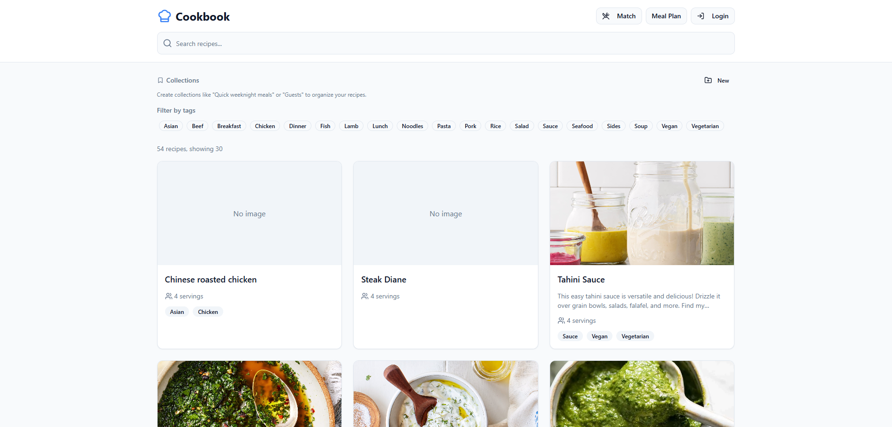
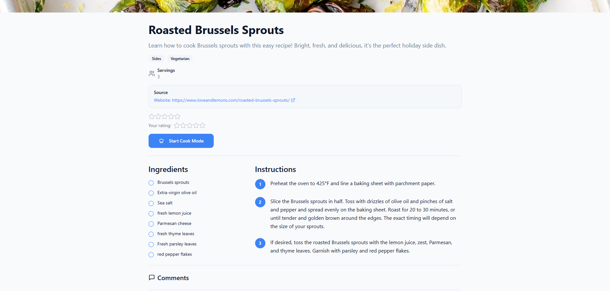
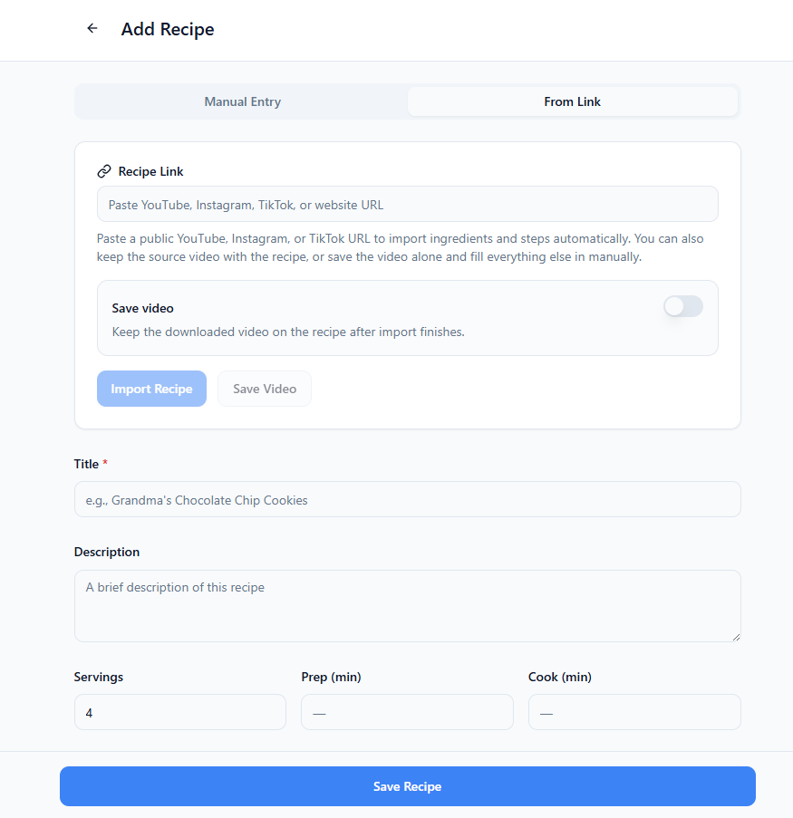
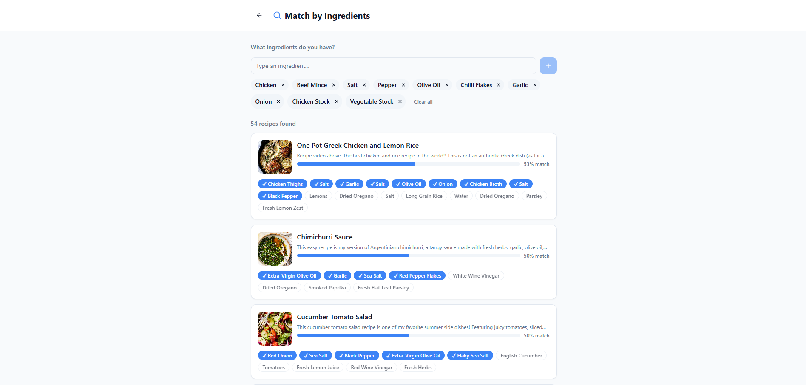
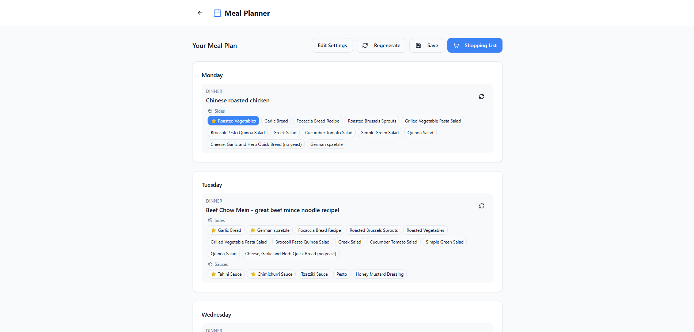
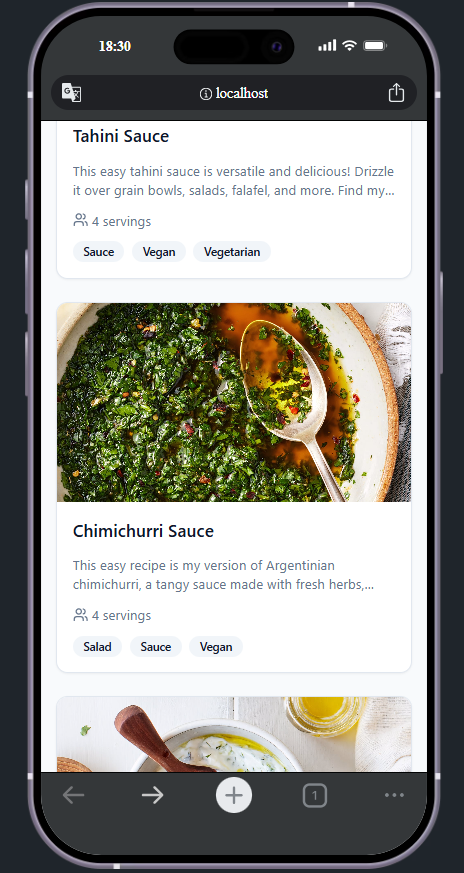

# emma-cookbook

EMMA stands for Easy Meals Made Accessible.

emma-cookbook is a self-hosted recipe app built for local and home use. It is made for people who want a private cookbook on their own network, with a simple interface that feels good on both desktop and mobile.

This is the kind of app you open when you are hungry, half-organised, and trying to answer the eternal question of what to cook tonight. Instead of scattering recipes across browser bookmarks, social videos, notes apps, and screenshots, emma-cookbook pulls everything into one place and makes it actually usable.

## A Cookbook That Wants To Be Used

emma-cookbook is not just a place to dump links. It is designed to help you find the right recipe quickly, whether you remember the name, a tag, a favorite, a rating, or the collection you saved it in. Recipe pages are built to be useful in the middle of cooking, with ingredients, servings, source links, comments, ratings, and room for the little details that usually get lost.

Cook mode keeps the process moving by walking through the recipe step by step and matching ingredients automatically along the way. It is built for real cooking, not just pretty browsing.

## Bring In Recipes From The Places People Actually Find Them

Some recipes are handwritten. Some come from websites. Some come from a TikTok that you found while doomscrolling. emma-cookbook supports all of that.

You can add recipes manually or import them from the web, Instagram, YouTube, and TikTok. When a supported video includes spoken instructions, the app can extract the useful bits and fold them into the recipe flow. You can also keep imported videos in the app, which means less scrolling through your history and less trying to remember who posted that pasta thing three weeks ago.

## Built For Actual Kitchen Chaos

emma-cookbook makes it easier to work with what you already have. You can tag recipes as mains, sides, or sauces, suggest pairings for specific dishes, and match recipes against ingredients already in your fridge. That makes the app feel less like a static archive and more like a helpful kitchen sidekick.

Meal planning is part of the fun too. You can build plans around what you want to cook, turn those plans into shopping lists, and export them as PDFs so they are easy to bring to the supermarket without needing your whole home setup with you.

## Looks Good On The Counter And In Your Pocket

The app is built to feel comfortable on a kitchen counter, a laptop, or a phone.

Desktop             |  Mobile
:-------------------------:|:-------------------------:
  |  

## Want To Run It Yourself?

The docs keep the setup simple. You can run emma-cookbook locally for development, or bring up the full Docker stack for a more complete deployment.

- [Documentation home](https://dennislent.github.io/emma-cookbook/)
- [Introduction](https://dennislent.github.io/emma-cookbook/introduction/)
- [Setup](https://dennislent.github.io/emma-cookbook/setup/)
- [Admin guide](https://dennislent.github.io/emma-cookbook/admin-guide/)
